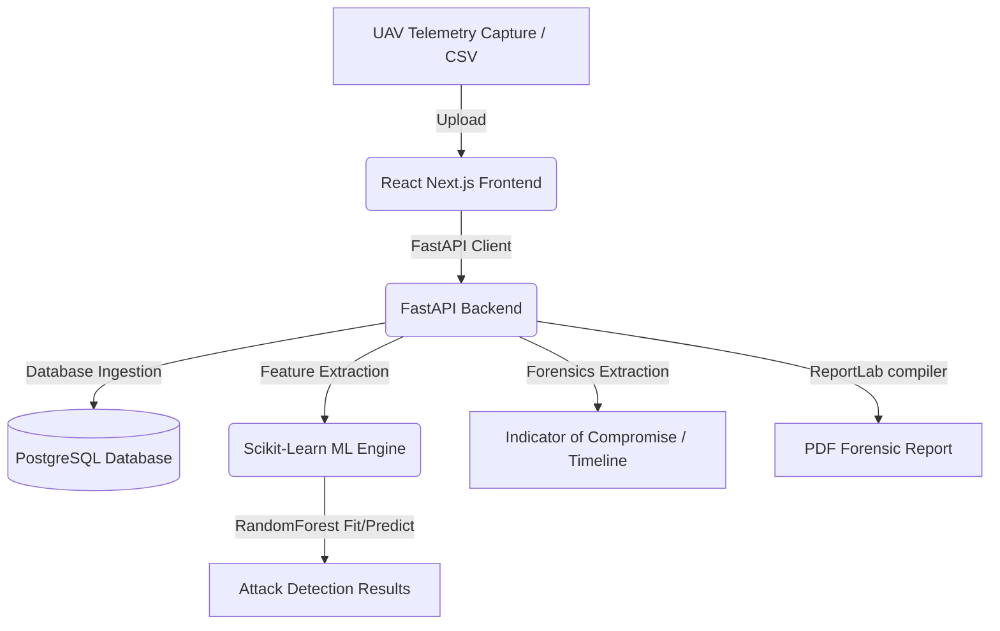

# Drone Network Traffic Analysis & Attack Detection System
### BSERC Cybersecurity & Digital Forensics Internship Project

A professional, high-fidelity SOC (Security Operations Center) dashboard designed for real-time monitoring of UAV (Unmanned Aerial Vehicle/Drone) network traffic, detecting cyber-attacks using Machine Learning, and conducting post-incident digital forensics investigations.

---

## Table of Contents
1. [Project Overview](#project-overview)
2. [Objectives](#objectives)
3. [System Architecture](#system-architecture)
4. [Tech Stack](#tech-stack)
5. [Key Features](#key-features)
6. [Machine Learning Module](#machine-learning-module)
7. [Database Schema](#database-schema)
8. [Folder Structure](#folder-structure)
9. [Installation & Deployment Guide](#installation--deployment-guide)
10. [Sample Datasets](#-sample-datasets)
11. [Verification & Walkthrough](#verification--walkthrough)
12. [Future Improvements](#future-improvements)
13. [License](#license)

---

## Project Overview
Modern UAVs rely heavily on wireless communication networks, exposing them to telemetry spoofing, Denial of Service (DoS), command injections, and signal jamming. This project implements a practical framework to secure drone communications by capturing simulated network traffic, training a **Random Forest Classifier** to flag anomalous packets, and providing a forensic analysis workflow to reconstruct attack timelines and extract Indicators of Compromise (IoCs).

---

## Objectives
* Understand vulnerability vectors in UAV communication ecosystems.
* Ingest and sanitize telemetry packet captures (CSV formats).
* Build an automated, lightweight Machine Learning classifier capable of separating normal operational data from active attacks.
* Simulate a digital forensic pipeline that maps the attack sequence and identifies malicious MAC/IP footprints.
* Generate compliance-ready forensic investigation PDF reports.

---

## System Architecture



---

## Tech Stack
* **Frontend**: React 18, Next.js 14 (App Router), TypeScript, Tailwind CSS, Recharts (visualizations), Framer Motion (animations), Sonner (alerts).
* **Backend**: FastAPI (Python 3.x), SQLAlchemy, Uvicorn, ReportLab (PDF compiler).
* **Machine Learning**: Scikit-Learn, Pandas, NumPy.
* **Database**: PostgreSQL 16.
* **Containerization**: Docker & Docker Compose.

---

## Key Features
1. **Interactive SOC Dashboard**: Displays total telemetry volume, threat index metrics, chronological area timelines, protocol breakdowns, and recent incident logs.
2. **Dataset Management**: Drag-and-drop CSV parser with upload progress bars and server-side ingestion buttons.
3. **Deep Packet Inspector**: Paginated data grid with filters (by protocol/attack), header sorting, and a detailed sidebar inspector containing raw payload decoders.
4. **Machine Learning Model Builder**: Supports setting RandomForest hyperparameters, triggers training partitions (70/30), computes Accuracy/Precision/Recall/F1, and renders a visual CSS Confusion Matrix.
5. **Incidents Investigator**: Maps attack sequences chronologically, indexes extracted threat signatures (IP and MAC addresses), and performs protocol impact rate scoring.
6. **PDF Compiler**: Generates formal compliance forensic summaries containing statistics tables, recommendations, and executive briefs.
7. **Compliance Audit Logs**: Independent tab view showing user actions (audit trails) and background system executions.
8. **Settings Panel**: Manages classification decision limits, security credentials, and system data resets.

---

## Machine Learning Module
The machine learning pipeline is kept completely modular in the `/ml` directory:
* `data_loader.py`: Handles CSV read operations.
* `preprocessing.py`: Sanitizes features (`packet_size`, `time_delay`, `transmission_rate`) and splits them into training/testing partitions.
* `trainer.py`: Fits the `RandomForestClassifier` with user-defined tree estimators (`n_estimators`).
* `evaluator.py`: Evaluates performance, returning accuracy, precision, recall, F1, and the confusion matrix.
* `model_manager.py`: Serializes and loads models (`.joblib` or `.pkl`).

---

## Database Schema
The project uses PostgreSQL with a fully normalized design:
* `users`: Stores the system administrator credentials.
* `user_settings`: Holds defaults for ML thresholds.
* `uploaded_datasets`: Logs dataset metadata and parse status.
* `packet_logs`: Stores individual telemetry packets.
* `ml_models`: Stores metrics and file paths of trained classifiers.
* `attack_detection_results`: Maps packets to ML predictions and confidence ratings.
* `investigations`: Houses forensic cases.
* `indicators_of_compromise`: Catalogues malicious IP and MAC logs.
* `alerts`: Threat alarms.
* `reports`: Logs generated PDF locations.
* `audit_logs`: Immutable security records.
* `system_activity`: Background events.

---

## Folder Structure
```
├── backend/
│   ├── app/
│   │   ├── models/        # SQLAlchemy Models
│   │   ├── routes/        # API Routers (Auth, Datasets, ML, Forensics)
│   │   ├── schemas/       # Pydantic Schemas
│   │   ├── services/      # Business Logic (Dashboard, Reports)
│   │   ├── utils/         # Helpers (Security, Audit)
│   │   ├── config.py      # App Configurations
│   │   ├── database.py    # Database connection
│   │   └── main.py        # FastAPI Application entry point
│   ├── scripts/           # User seeding scripts
│   ├── Dockerfile
│   └── requirements.txt
├── database/
│   ├── init.sql           # Schema DLL
│   └── seed.sql           # System seeds
├── datasets/
│   └── generate_sample.py # Test telemetry CSV generator
├── frontend/
│   ├── app/               # Next.js Pages (Dashboard, Traffic, ML, etc.)
│   ├── components/        # Layout and UI Components
│   ├── lib/               # API client
│   ├── Dockerfile
│   └── package.json
├── ml/
│   ├── data_loader.py
│   ├── preprocessing.py
│   ├── trainer.py
│   ├── evaluator.py
│   └── model_manager.py
├── docker-compose.yml
└── README.md
```

---

## Installation & Deployment Guide

### Prerequisites
* [Docker Desktop](https://www.docker.com/products/docker-desktop/) (Recommended for easy setup)
* Alternatively (for manual local running): **Python 3.10+**, **Node.js 18+**, and a running **PostgreSQL** database.

### Method A: Docker Compose Deployment (Recommended)
1. Clone the repository and navigate to the directory:
   ```bash
   cd "Drone Network Traffic Analysis"
   ```
2. Build and spin up all containers in detached mode:
   ```bash
   docker-compose up --build -d
   ```
3. Seed the default database users:
   ```bash
   docker exec -it drone_soc_api python backend/scripts/seed_users.py
   ```
4. Access the SOC interface at: `http://localhost:3001`

---

### Method B: Manual Local Setup

#### 1. Database Setup
Create a PostgreSQL database named `drone_soc` and run the schema definitions in `database/init.sql` and `database/seed.sql` to initialize tables.

#### 2. Backend API Setup
1. Open a terminal, navigate to `/backend` and create a virtual environment:
   ```bash
   cd backend
   python -m venv .venv
   .venv\Scripts\activate   # Windows
   source .venv/bin/activate # Linux/macOS
   ```
2. Install Python dependencies:
   ```bash
   pip install -r requirements.txt
   ```
3. Set your environment variables in a `.env` file (refer to `.env.example` in workspace root).
4. Seed the users:
   ```bash
   python scripts/seed_users.py
   ```
5. Run the FastAPI dev server:
   ```bash
   uvicorn app.main:app --reload --host 127.0.0.1 --port 8000
   ```

#### 3. Frontend UI Setup
1. Open a new terminal and navigate to `/frontend`:
   ```bash
   cd frontend
   npm install
   ```
2. Run the Next.js development server:
   ```bash
   npm run dev
   ```
3. Access the SOC dashboard at `http://localhost:3001`.

---

## 📊 Sample Datasets

For quick testing, the repository includes three ready-to-use UAV network traffic datasets:

- `drone_network_data.csv` — Mixed UAV network traffic suitable for traffic analysis and ML model training.
- `drone_normal_flight.csv` — Sample traffic representing normal UAV flight activity.
- `drone_jamming_attack.csv` — Sample traffic representing a simulated UAV jamming attack scenario.

These datasets can be uploaded directly through the **Datasets** module, allowing the platform to be tested without generating new telemetry first.

> **Note:** These source CSV files are stored separately from runtime uploads and are not deleted when **Reset Demo Data** is used.
---

## Verification & Walkthrough
To verify the entire pipeline, use the following login credentials:
* **Email**: `admin@bserc.com`
* **Password**: `Admin@123`

### Step-by-Step Workflow:
1. **Generate Telemetry**: If running locally, generate the CSV file:
   ```bash
   python datasets/generate_sample.py
   ```
   This generates `drone_network_data.csv` inside `/datasets`.
2. **Upload Dataset**: Navigate to the **Datasets** tab, drag and drop `drone_network_data.csv`, and click **Ingest Data**.
3. **Train Model**: Go to **ML Detection**, select the dataset, set tree estimators (e.g. 50), and click **Execute AI Training**. Review the resulting Accuracy, Precision, Recall, and Confusion Matrix.
4. **Run Predictions**: Switch to the **Run Predictions** tab, choose your dataset & trained model, and click **Run ML Scan**.
5. **Investigate Forensics**: Navigate to the **Forensics** tab, select the dataset, and click **Execute Forensic Scan**. Reconstruct the timeline, explore rogue MACs and source IPs.
6. **Export Report**: Click **Export Forensic Report PDF**. Navigate to the **Reports** tab and download your official generated PDF report.

---

## Future Improvements
* **Live Telemetry Stream**: Support WebSockets ingestion of MAVLink frames directly.
* **Model Comparisons**: Expand the ML engine to support XGBoost, SVMs, and neural network architectures.
* **Automated Firewall Rules**: Script background triggers to export blocked IP address lists straight into host firewalls.

---

## License
Developed as part of the **BSERC Project Internship on Cyber Security & Digital Forensics**.
All rights reserved.
